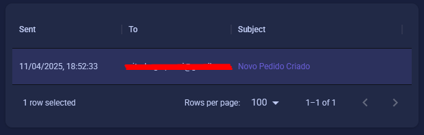

# Dashboard

 Aplicação fullstack para gerenciar e visualizar dados de pedidos, produtos e categorias, com integração a aws(Localstack), com o serviços S3 e SES. Conta tambem com frontend construido com Material UI e Vite com React e um backend construido com NestJS.

## Instruçoes para execução

### Pre-requisitos

- [Docker](https://www.docker.com/get-started) instalado na maquina
- [Docker Compose](https://docs.docker.com/compose/) para orquestrar os containers

### Instalação

Na raiz do projeto execute:

```sh
docker compose up
```
Ou

```sh
docker compose up -d
```
para iniciar em modo desanexado(sem logs)

### Sistema de envio de emails

Como o sistema utiliza de localstack para simular a infraestrutura da aws, o sistema de envio de email implementado nele, roda apenas na localstack, e para testalo precisa acessar o dashboard do mesmo, pelo [link](https://app.localstack.cloud/dashboard), apos isso deve se acessar a aba de "Resource browser" e clicar em "SES", nessa aba podera ver os emails que seriam enviados.



### Script de massa de dados

Por padrão ao executar o docker-compose, o banco de dados ja ira ser populado atraves de um script encontrado no arquivo seed.ts, na raiz do projeto backend, mas caso queira re-executar o seed, basta seguir este passo a passo

1. Acesse o container backend:

   ```sh
   docker compose exec -it backend bash
   ```

2. Rode o comando de seeding:

   ```sh
   mpm run start:seed
   ```

Com isso ele ira criar de forma completamente aleatoria, produtos, categorias e pedidos

### Frontend

Para acessar o frontend basta acessar [esse link](http://localhost:80) que sera redirecionado para a porta onde esta hospedado, caso o botão não funcione, este é o link:

```
http://localhost:80
```